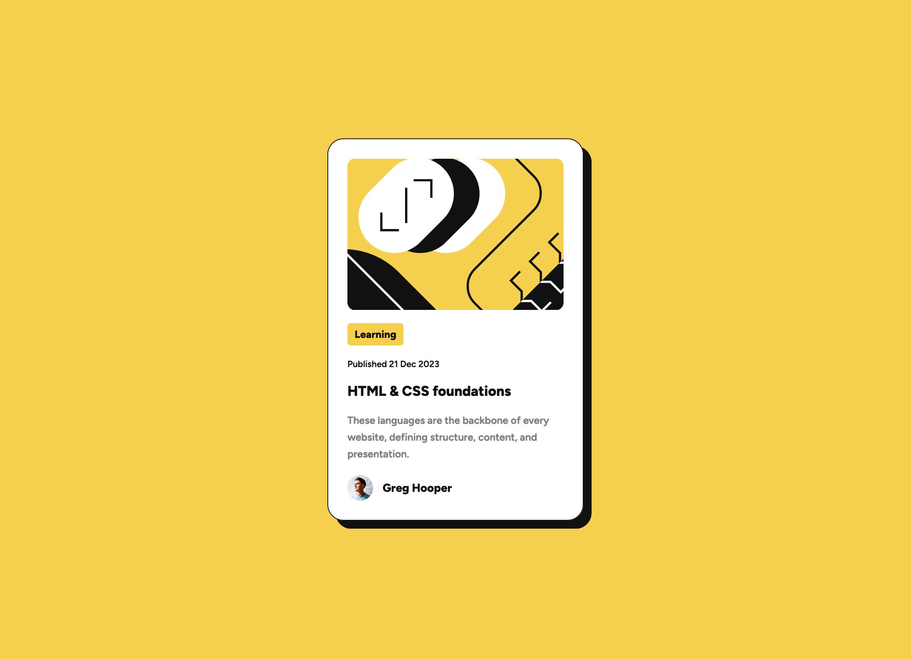

# Frontend Mentor - Blog preview card solution

This is a solution to the [Blog preview card challenge on Frontend Mentor](https://www.frontendmentor.io/challenges/blog-preview-card-ckPaj01IcS). Frontend Mentor challenges help you improve your coding skills by building realistic projects. 

## Table of contents

- [Overview](#overview)
  - [The challenge](#the-challenge)
  - [Screenshot](#screenshot)
  - [Links](#links)
- [My process](#my-process)
  - [Built with](#built-with)
  - [Code Highlight](#code-highlight)
  - [Useful resources](#useful-resources)
- [Author](#author)
- [Acknowledges](#acknowleges)

## Overview

### The challenge

Users should be able to:

- See hover and focus states for all interactive elements on the page

### Screenshot




### Links

- [Solution URL](https://github.com/edpau/FM_Blog_preview_card)
- [Live Site URL](https://edpau.github.io/FM_Blog_preview_card/)

## My process

### Built with

- Semantic HTML5 markup
- BEM CSS methodology
- Flexbox
- Mobile-first workflow

### Code Highlight

- learning yellow box shape background
  - display: inline-block;
  - or width: fit-content; 

```css
.card__genre-heading {
  display: inline-block;
  background-color: var(--yellow);
  padding: 6px 9px;
  border-radius: 4px;
  font-size: 0.8rem;
}
```

- center the card 
```css
.body {
  display: grid;
  place-items: center;
}
```

### Useful resources
- [@Demarcus11](https://www.frontendmentor.io/solutions/blog-preview-card-383Q-d2AE_) - very detail and structured solution. 

## Author

- Website - [Edward Pau](https://www.edpau.me)
- Frontend Mentor - [@edpau](https://www.frontendmentor.io/profile/edpau)

### Acknowledges
Thank you @Demarcus11